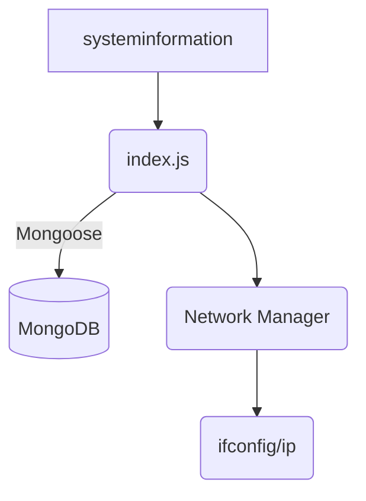

# system‑stats‑mongodb 📈🛠️

[](https://github.com/Shiro-nn/system-stats-mongodb/stargazers)
[](https://github.com/Shiro-nn/system-stats-mongodb/network/members)
[](https://github.com/Shiro-nn/system-stats-mongodb/issues)
[](https://github.com/Shiro-nn/system-stats-mongodb/commits)
[](LICENSE)
[](#)


> **system‑stats‑mongodb** — легковесный Node.js‑агент, который раз в 60 с собирает системные метрики (CPU, RAM, дисковые тома, сетевой трафик) и сохраняет их в MongoDB. В июле 2025 года проект заморожен и репозиторий переведён в **архив**: код сохранён *as‑is*, без планов на поддержку или новые фичи.

---

## ⚡ Ключевые возможности

* **Сбор метрик каждые 60 с** — на базе пакета `systeminformation`.
* **Хранение до 1 440 срезов** (≈ 24 ч) на документ с автоматическим удалением самых старых записей.
* **Цветной логгер** на `chalk` с уровнями `debug`·`log`·`warn`·`error`.
* **Экспорт в статический бинарь** через `pkg` (`npm run build`).

---

## 📦 Структура

| Файл/папка         | Назначение                                                                              |
| ------------------ | --------------------------------------------------------------------------------------- |
| `index.js`         | Главный цикл: подключение к MongoDB, определение внешнего IP, сбор и сохранение метрик. |
| `config.js`        | Конфигурация подключения (`mongoDB: "/system?authSource=admin"`).                       |
| `mongo.js`         | Mongoose‑схема: `ip`, `uptime`, `statistics[]`.                                         |
| `logger.js`        | Форматированный, цветной вывод логов.                                                   |
| `network/`         | Обёртка для чтения сетевой статистики (`ifconfig`, `ip`).                               |
|   ├─ `main.js`     | Менеджер сетевых данных, кэш и агрегация `global`.                                      |
|   ├─ `ifconfig.js` | Парсер вывода `ifconfig`.                                                               |
|   ├─ `ip.js`       | Парсер вывода `ip -s link`.                                                             |
|   └─ `exec.js`     | Унифицированный вызов shell‑команд.                                                     |

---

## 🚀 Быстрый старт

```bash
# 1. Клонируем репозиторий
git clone https://github.com/Shiro-nn/system-stats-mongodb.git
cd system-stats-mongodb

# 2. Устанавливаем зависимости
npm install

# 3. Запускаем агент
node index.js        # пишет метрики каждые 60 секунд
```

> Нужен запущенный **MongoDB** и доступ к `https://myexternalip.com` для определения внешнего IP.

### 🔧 Сборка бинаря

```bash
npm run build        # итоговый файл ./system-stats (Linux x64)
```

---

## 🗺️ Мини‑архитектура



---

## 🛠️ Зависимости

* **Node.js 18+**
* **MongoDB 5+**
* NPM‑пакеты: `systeminformation`, `mongoose`, `chalk`, `pkg` (dev)

---

## 🤝 Вклад

Проект **заморожен** — принимаются только критические security‑patch’и. Хотите развивать идею — форкните репозиторий и действуйте свободно.

---

## ⚖️ Лицензия

Код распространяется под лицензией **ISC** (см. `LICENSE`).

> Спасибо за внимание! Надеемся, этот архив окажется полезен в ваших DevOps‑скриптах и дашбордах.
